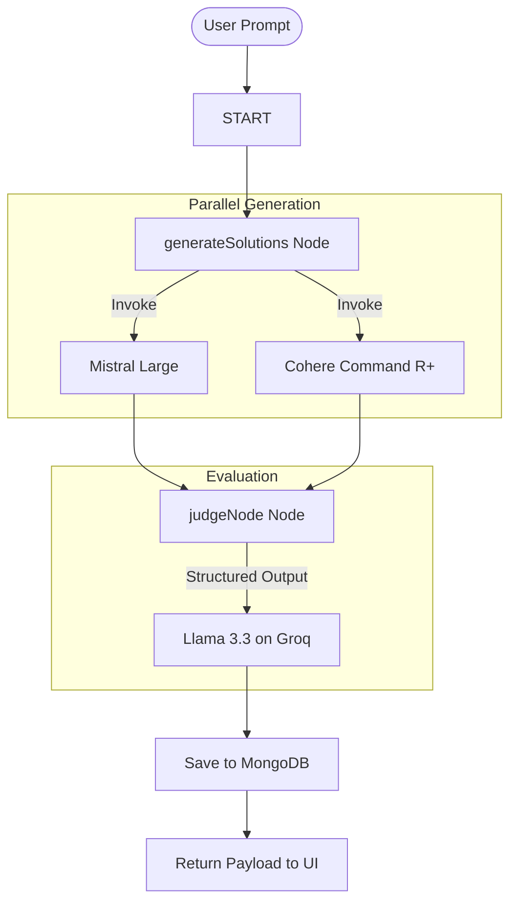

# ⚔️ AI Battle Arena

AI Battle Arena is a state-of-the-art web application that compares responses from multiple leading Large Language Models (LLMs) in real time. It utilizes a structured AI referee to evaluate answer quality, grade solutions, and persist battle histories in a MongoDB database.

---

## 🚀 Key Features

* **Dual-Model Duels:** Pits **Mistral Large** (`mistral-large-latest`) against **Cohere Command R+** (`command-r-plus-08-2024`) in parallel to solve programming and architecture problems.
* **Structured AI Referee:** Employs **Llama 3.3 (Groq)** as an expert evaluator. The judge scores both responses out of 10 and provides structured reasoning based on:
  * Correctness
  * Time & Space Complexity
  * Readability & Best Practices
  * Scalability
* **Interactive Arena UI:** A stunning, dark-mode glassmorphism interface featuring custom micro-animations, code syntax highlighting, tabbed navigation (Arena, History, Leaderboard, Docs), and responsive layouts.
* **Persistent Duel History:** Backed by MongoDB to automatically store every duel (prompts, raw solutions, scores, and winner details) and reload past battles into the arena in one click.

---

## 📐 System Architecture

The backend utilizes **LangGraph** (`@langchain/langgraph`) to orchestrate a state-driven workflow for generating and judging responses. 



---

## 🛠️ Tech Stack

### Frontend
* **Core:** React, JavaScript (ES6+)
* **Styling:** Custom CSS (Premium Glassmorphism, animations, custom scrollbars)
* **Icons:** Google Material Symbols

### Backend
* **Runtime:** Node.js, TypeScript, `tsx` (TypeScript Execute)
* **Framework:** Express
* **Orchestration:** LangChain, LangGraph
* **Database:** MongoDB & Mongoose

---

## ⚙️ Environment Configuration

Create a `.env` file inside the `backend` directory with the following variables:

```env
# Server Port
PORT=3000

# Database URL
MONGOOSE_URL=mongodb+srv://<username>:<password>@<cluster>.mongodb.net/<dbname>

# API Keys for AI Providers
GOOGLE_API_KEY=your_google_gemini_key_here
MISTRAL_API_KEY=your_mistral_api_key_here
COHERE_API_KEY=your_cohere_api_key_here
GROW_API_KEY=your_groq_api_key_here
```

---

## 💻 Quick Start

### 1. Clone the repository and install dependencies
```bash
# Clone the repository
git clone https://github.com/kaku-coder/AI-Battle-Arena.git
cd AI-Battle-Arena

# Install Backend dependencies
cd backend
npm install

# Install Frontend dependencies
cd ../frontend
npm install
```

### 2. Run the development environment

Open two terminal sessions:

* **Start Backend:**
  ```bash
  cd backend
  npm run dev
  # Server will run on port 3000
  ```

* **Start Frontend:**
  ```bash
  cd frontend
  npm run dev
  # Frontend will run locally (typically port 5173)
  ```

---

## 💾 Database Schema

Battles are stored using a Mongoose schema in `backend/src/schema/chatSchema.js`:

```javascript
{
  problem: { type: String, required: true },  // The user prompt
  userId: { type: String, default: "guest" }, // User ID identifier
  solution_1: String,                         // Model A solution
  solution_2: String,                         // Model B solution
  model_1: String,                            // Model A name
  model_2: String,                            // Model B name
  judge_model: String,                        // Referee model name
  winner: String,                             // "solution_1", "solution_2", or "draw"
  judge: {
    solution_1_score: Number,
    solution_2_score: Number,
    solution_1_response: String,
    solution_2_response: String
  }
}
```

---

## 📄 License
This project is licensed under the MIT License.
