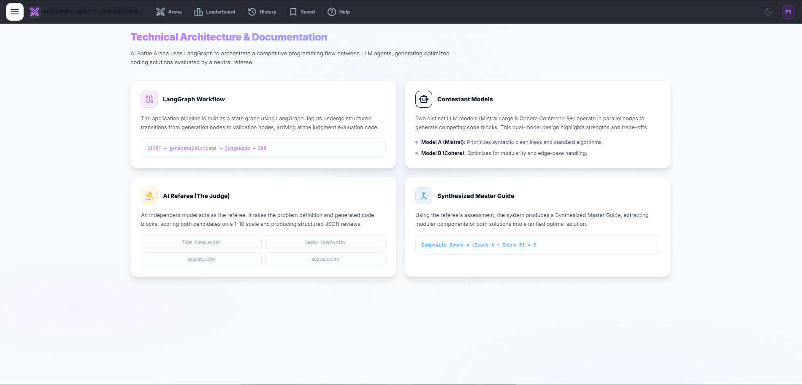

# AI Battle Arena

Two AI models walk into a bar. One writes code. The other writes better code. An AI judge decides who wins.

That's basically what this project does — but with a really nice UI.

You type in a programming challenge, and two different LLMs (Mistral Large and Cohere Command R+) independently generate solutions. Then a third AI (Llama 3.3 via Groq) judges both answers on correctness, complexity, readability, and scalability. Scores come back, a winner is declared, and the whole thing is saved to your history.



---

## How it actually works

The backend is built on **LangGraph** — a framework for running multi-step AI workflows as a state graph. Here's the flow:

```
Your Prompt
    │
    ▼
┌──────────────────────────┐
│   generateSolutions      │
│   (runs in parallel)     │
├────────────┬─────────────┤
│            │             │
▼            ▼             │
Mistral    Cohere          │
Large      Command R+      │
│            │             │
└────────────┴─────────────┘
         │
         ▼
┌──────────────────────────┐
│      judgeNode           │
│  Llama 3.3 (Groq)       │
│  ↓ fallback: Gemini 2.0  │
└──────────────────────────┘
         │
         ▼
   Score & Save to DB
```

Both models get the same prompt at the same time (parallel execution via `Promise.all`). The judge gets both solutions plus the original prompt, scores each on a 0-10 scale, and picks a winner. If Groq goes down, Gemini picks up the judging automatically.

Each contestant model also has a fallback — if Mistral or Cohere fails, Groq's Llama 3.1 8B steps in. So the whole thing is pretty resilient.

---

## Screenshots

> _Add your screenshots here_

| Arena | Judge Verdict | Leaderboard |
|-------|---------------|-------------|
|  |  |  |

---

## Tech Stack

**Frontend**
- React 19 + Vite 8
- Tailwind CSS 4
- Google Material Symbols
- Custom glassmorphism design system
- Dark/Light theme toggle

**Backend**
- Express 5 + TypeScript
- LangChain + LangGraph (workflow orchestration)
- MongoDB + Mongoose
- Zod (structured output validation)

**AI Models**
| Role | Model | Provider | Fallback |
|------|-------|----------|----------|
| Contestant A | Mistral Large | Mistral AI | Groq Llama 3.1 8B |
| Contestant B | Cohere Command R+ | Cohere | Groq Llama 3.1 8B |
| Judge | Llama 3.3 70B | Groq | Gemini 2.0 Flash |

---

## Project Structure

```
aiBattarlAerana/
├── backend/
│   ├── server.ts                     # Entry point
│   ├── src/
│   │   ├── app.ts                    # Express routes
│   │   ├── config/congi.ts           # Config + MongoDB connection
│   │   ├── services/
│   │   │   ├── grap.ai.service.ts    # LangGraph workflow
│   │   │   └── model.service.ts      # LLM initializations
│   │   ├── schema/
│   │   │   ├── chatSchema.ts         # Battle schema
│   │   │   └── comparisonSchema.ts   # Saved comparison schema
│   │   └── routes/
│   │       ├── comparisonRoutes.ts   # CRUD for comparison presets
│   │       └── leaderboardRoutes.ts  # Leaderboard + ELO calculation
│   └── .env                          # API keys (gitignored)
│
└── frontend/
    ├── src/
    │   ├── App.jsx                   # Main app — tabs, state, arena logic
    │   ├── index.css                 # Full design system (700+ lines)
    │   └── components/
    │       ├── Sidebar.jsx
    │       ├── SolutionCard.jsx      # Model response display
    │       ├── JudgeVerdict.jsx      # Score breakdown
    │       ├── Leaderboard.jsx       # ELO rankings
    │       ├── History.jsx           # Past battles
    │       ├── SavedComparisons.jsx  # Model matchup presets
    │       ├── HelpPage.jsx
    │       ├── Docs.jsx
    │       ├── ChatItem.jsx
    │       └── TypewriterEffect.jsx
    └── vite.config.js
```

---

## API Endpoints

| Method | Endpoint | What it does |
|--------|----------|-------------|
| POST | `/graph` | Run a battle — send `{ "problem": "your prompt" }` |
| GET | `/history` | Get all past battles |
| GET | `/health` | Server health check |
| GET | `/api/leaderboard` | Model rankings with ELO scores |
| GET | `/api/comparisons` | List saved comparison presets |
| POST | `/api/comparisons` | Create a new preset |
| DELETE | `/api/comparisons/:id` | Delete a preset |

---

## Setup

### Prerequisites

- Node.js (v18+)
- MongoDB Atlas account (or local MongoDB)
- API keys for Mistral, Cohere, Groq, and Google AI

### 1. Clone and install

```bash
git clone https://github.com/kaku-coder/AI-Battle-Arena.git
cd AI-Battle-Arena

# Backend
cd backend
npm install

# Frontend
cd ../frontend
npm install
```

### 2. Environment variables

Create a `.env` file in the `backend/` folder:

```env
PORT=3000
MONGOOSE_URL=mongodb+srv://<user>:<pass>@<cluster>.mongodb.net/<dbname>

GOOGLE_API_KEY=your_key
MISTRAL_API_KEY=your_key
COHERE_API_KEY=your_key
GROW_API_KEY=your_key
```

### 3. Run it

Open two terminals:

**Terminal 1 — Backend:**
```bash
cd backend
npm run dev
```

**Terminal 2 — Frontend:**
```bash
cd frontend
npm run dev
```

Backend runs on `http://localhost:3000`, frontend on `http://localhost:5173`.

---

## Database

Two MongoDB collections:

**chats** — Every battle ever run
```js
{
  problem: String,          // The prompt
  userId: String,           // "guest" by default
  solution_1: String,       // Model A's response
  solution_2: String,       // Model B's response
  model_1: String,          // "Mistral Large"
  model_2: String,          // "Cohere Command R+"
  judge_model: String,      // "Llama 3.3 (Groq)"
  winner: String,           // "solution_1" | "solution_2" | "draw"
  judge: {
    solution_1_score: Number,
    solution_2_score: Number,
    solution_1_response: String,
    solution_2_response: String
  }
}
```

**comparisons** — Saved matchup presets
```js
{
  name: String,         // "Code Quality Battle"
  model1: String,       // "Mistral Large"
  model2: String,       // "Cohere Command R+"
  judgeModel: String    // "Llama 3.3 (Groq)"
}
```

---

## Features in Detail

### The Arena
Type any programming challenge — "write a binary search in Python", "design a URL shortener", "implement a LRU cache" — and hit Enter. Two AI models independently generate solutions side by side with a typewriter animation. The judge evaluates both and picks a winner.

### Leaderboard
Tracks every model's performance across all battles. Uses a custom ELO-style rating system: `1000 + (winRate * 5) + (avgScore * 20)`. Shows win rate bars, average scores, and rank badges.

### History
All your past battles are saved automatically. Search through them, click "Load in Arena" to re-run or review any previous result.

### Saved Comparisons
Save your favorite model matchups as presets. Pick Model A, Model B, and the judge model — save it and load it instantly next time.

### Docs
Explains the LangGraph workflow, contestant models, judge criteria, and the synthesized master guide concept.

### Dark/Light Theme
Full theme toggle in the top-right corner. Both themes are implemented with CSS custom properties.

---

## How the Judge Thinks

The judge model receives a system prompt asking it to evaluate solutions on:

1. **Correctness** — Does the code actually work?
2. **Time Complexity** — Is the algorithm efficient?
3. **Space Complexity** — Memory usage
4. **Readability** — Clean code, good naming, comments
5. **Scalability** — Can it handle growth?
6. **Best Practices** — Language idioms, error handling

It scores each solution 0-10, provides reasoning, and returns structured JSON (validated with Zod). The model with the higher score wins. If scores are equal, it's a draw.

---

## License

MIT — do whatever you want with it.

---

Built by [kaku-coder](https://github.com/kaku-coder)
